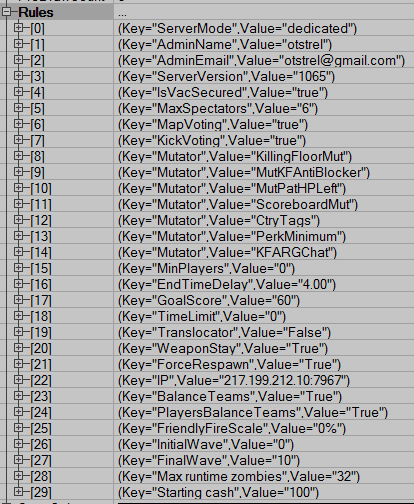

# Custom Server Details


Allows to color, rename, edit other server infos, print game states (aka WIPE, WIN, LOBBY, etc) and players states (DEAD, SPECTATING, etc). And you can add your own haiku's / custom key-infos.

## Installation

```cpp
`KillingFloor.ini`
[Engine.GameEngine]
;ServerActors=IpDrv.MasterServerUplink 
ServerActors=CustomServerDetails.CSDMasterServerUplink
```

## Building and Dependancies

At the moment of 2021.03.27 there are no dependencies.

Use [KFCmdlet and it's batches](https://github.com/InsultingPros/KFCmdlet) for easy compilation.

```cpp
EditPackages=CustomServerDetails
```

## Config Files

Define your custom tags and add them in `infoblocks`. Just check the [CustomServerDetails.ini](Configs/CustomServerDetails.ini 'main config') for reference.

For default `serverinfo` keys:



## Steam workshop

<https://steamcommunity.com/linkfilter/?url=https://github.com/InsultingPros/CustomServerDetails/releases>
