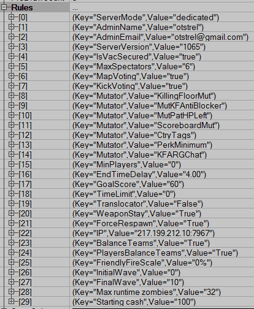

# Custom Server Details

[](https://github.com/InsultingPros/CustomServerDetails/releases)

Allows to color, rename, edit other server infos, print game states (aka WIPE, WIN, LOBBY, etc) and players states (DEAD, SPECTATING, etc). And you can add your own haiku's / custom key-infos.

If you want to add additional variables into server info, check [Custom Server Details Extension](https://github.com/InsultingPros/CustomServerDetailsExtension).

## Installation

> [!NOTE]
> To avoid weird characters in Steam server browser and gametrackers - set your NON colored server name in `Killingfloor.ini` -> `[Engine.GameReplicationInfo]` -> `ServerName`.

```ini
KillingFloor.ini
[Engine.GameEngine]
; ServerActors=IpDrv.MasterServerUplink
ServerActors=CustomServerDetails.CSDMasterServerUplink
```

## Building

Use [KF Compile Tool](https://github.com/InsultingPros/KFCompileTool) for easy compilation.

```ini
EditPackages=CustomServerDetails
```

## Config Files

Define your custom tags and add them in `infoblocks`. Just check the [CustomServerDetails.ini](Configs/CustomServerDetails.ini 'main config') for reference.

For default `serverinfo` keys:



## Steam workshop

<https://steamcommunity.com/sharedfiles/filedetails/?id=2463978063>
